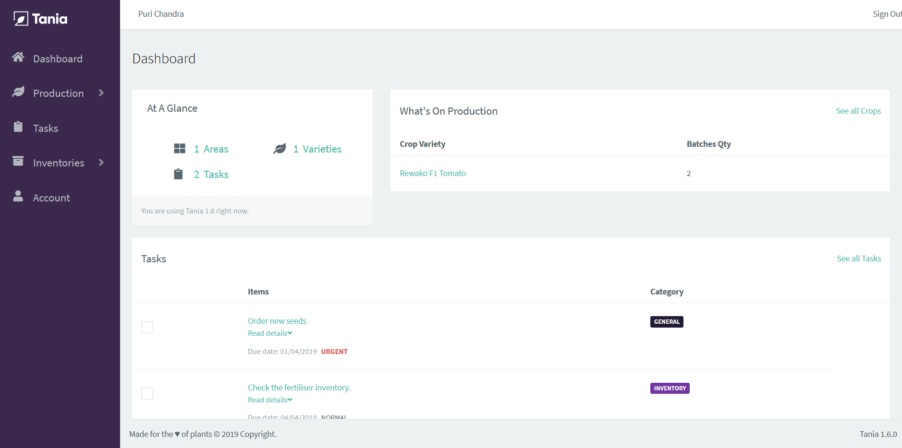

<div align="center">
    
    <h1>The Farmer Journal</h1>
    
    
    <a href="https://t.me/usetania"></a>
    
    <a href="https://travis-ci.com/Tanibox/tania-core">
      
    </a>
    <a href="https://opensource.org/licenses/Apache-2.0" target="_blank"></a>
</div>

# Warning

This is the development branch of Tania. Changes can occur nightly. If you need the stable branch you can checkout [the master branch](https://github.com/Tanibox/tania-core/tree/master).

---

**Tania** is a free and open source farm management software. You can manage your farm areas, farm reservoirs, farm tasks, inventories, and the crop growing progress. It is designed for any type of farms.

Download Tania for Windows x64 and Linux x64 on [the release page](https://github.com/Tanibox/tania-core/releases/tag/1.7.1).



## Table of Contents

* [Getting Started](#getting-started)
    * [Prerequisites](#prerequisites)
    * [Building Instructions](#building-instructions)
    * [Database Engine](#database-engine)
    * [Run The Test](#run-the-test)
* [REST APIs](#rest-apis)
* [Roadmap](#roadmap)
* [Contributing to Tania](#contributing-to-tania)
    * [Localisation](#localisation)
* [Support Us](#support-us)
    * [Contributors](#contributors)
    * [Backers](#backers)
    * [Sponsors](#sponsors)
* [Authors](#authors)
* [Copyright and License](#copyright-and-license)

## Getting Started

This software is built with [Go](https://golang.org) programming language. It means you will get an executable binary to run on your machine. You **don't need** extra software like MAMP, XAMPP, or WAMP to run **Tania**, but you may need MySQL database if you choose to use it instead of SQLite *(the default database.)*

If your OS is not listed on our releases page, you have to build Tania for your OS by yourself. You can follow our instructions to build **Tania**.

### Prerequisites
- [Go](https://golang.org) >= 1.11
- [NodeJS](https://nodejs.org/en/) 8 or 10

### Building Instructions
1. Clone the repo using `git clone https://github.com/Tanibox/tania-core.git`
2. Checkout the current stable version by using `git checkout tags/1.7.2 -b v1.7.2`
3. From the project root, call `go get` to install the Go dependencies.
4. Create a new file `conf.json` using the values from the `conf.json.example` and set it with your own values.
5. Issue `npm install` to install Vue.js dependencies.
6. To build the Vue.js, just run `npm run dev` for development purpose or `npm run prod` for production purpose.
7. Compile the source code with `go build`. It will produces `tania-core.exe` (on Windows) or `tania-core` (on Linux and OSX.)
8. Run the program from Terminal by issuing `./tania-core`, or from Windows Command Prompt by issuing `.\tania-core.exe`.
9. The default username and password are `tania / tania`.

### Database Engine

Tania uses SQLite as the default database engine. You may use MySQL as your database engine by replacing `sqlite` with `mysql` at `tania_persistence_engine` field in your `conf.json`.

```
{
  "app_port": "8080",
  "tania_persistence_engine": "sqlite",
  "demo_mode": true,
  "upload_path_area": "uploads/areas",
  "upload_path_crop": "uploads/crops",
  "sqlite_path": "db/sqlite/tania.db",
  "mysql_host": "127.0.0.1",
  "mysql_port": "3306",
  "mysql_dbname": "tania",
  "mysql_user": "root",
  "mysql_password": "root",
  "redirect_uri": [
      "http://localhost:8080",
      "http://127.0.0.1:8080"
  ],
  "client_id": "f0ece679-3f53-463e-b624-73e83049d6ac"
}
```

### Run The Test
- Use `go test ./...` to run all the Go tests.
- Use `npm run cypress:run` to run the end-to-end test

## REST APIs
**Tania** have REST APIs to easily integrate with any softwares, even you can build a mobile app client for it. You can import the JSON file inside Postman directory to [Postman app](https://www.getpostman.com).
## Roadmap

We want to share our high-level details of our roadmap, so that others can see our priorities in Tania development. You can read our roadmap on [the wiki](https://github.com/Tanibox/tania-core/wiki/Roadmap).

## Contributing to Tania

We welcome contributions, but request you to follow these [guidelines](contributing.md).

### Localisation

You can help us to localise Tania into your language by following these steps:

1. Copy `languages/template.pot` and paste it to `languages/locale` directory.
2. Rename it with your language locale code e.g: `en_AU.po`, `de_DE.po`, etc.
3. Fill `msgstr` key with your translation. You can edit the `.po` file by using text editor or PO Edit software.
4. Pull request your translation to the `master` branch.

### Build Tania localisation by yourself

**Note:** You will need to install GNU Gettext for your OS. Get it [here](https://www.gnu.org/software/gettext/).

You can build Tania in your language by changing the default language inside `resources/js/app.js`.

```
Vue.use(GetTextPlugin, {
  availableLanguages: { // add your language here
    en_GB: 'British English',
    id_ID: 'Bahasa Indonesia',
    hu_HU: 'Magyar Nyelv'
  },
  defaultLanguage: 'en_GB', // change this to your language
  translations: translations,
  silent: false
})
```

Then follow the instruction to [build Tania](#building-instructions).

## Support Us

You can become a backer or a sponsor for Tania through our [Open Collective page](https://opencollective.com/tania).

You can also support Tania development by buying the merchandise from [Tania Swag Store](https://teespring.com/stores/usetania).

### Contributors

This project exists thanks to all the people who contribute.
<a href="https://github.com/tanibox/tania-core/graphs/contributors"></a>

### Backers

Become a backer with a monthly donation and help us continue our activities. <a href="https://opencollective.com/tania"></a>

### Sponsors

Become a sponsor and get your logo on our README on GitHub with a link to your site. <a href="https://opencollective.com/tania"></a>

## Authors

Tania is a project of [Tanibox](https://tanibox.com).

## Copyright and License

Copyright to Tanibox and other contributors under [Apache 2.0](https://github.com/Tanibox/tania-core/blob/master/LICENSE) open source license.
